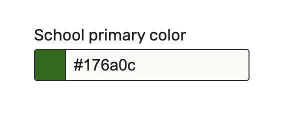
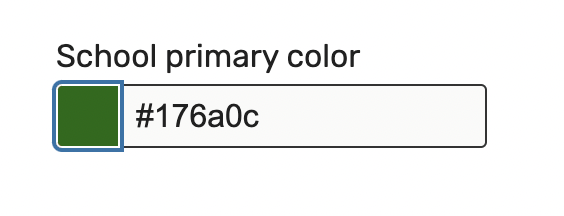
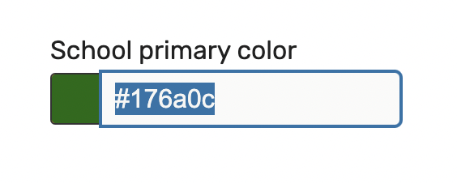
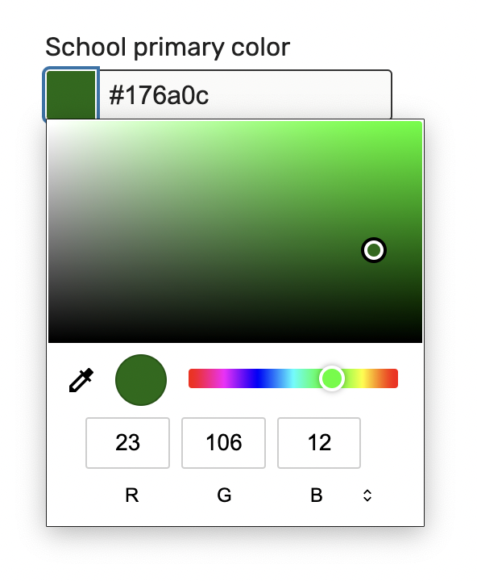

Please create an Angular form component to select a color. The appearance should match the example closely, unless you would like to make personal stylistic changes. If you make changes to the style, they should look polished. Uncomment the references to `<color-picker>` in `app.component.html`, and feel free to rename the component. Using Angular CLI is encouraged.

Testable requirements (Please write tests for these):

- It should have both an `<input type="color">` and an `<input type="text">` for choosing a color.
- Changing either the color input or the text input should update the other input.
- It should work with both template driven forms and reactive forms.
- It should take `label: string` as an input
- It should emit values of either `null` or valid hex codes (bonus points for strict typing)
- It should handle invalid text input (non-hex). Blanking the value is acceptable, but feel free to be creative.

Other requirements:

- Don't use an external library for the color picker.
- If you make stylistic changes, please ensure that the color input looks noticeably different from the default browser's implementation.
- It should have clear focus states for both the color input and the text input
  
  
- It should take appropriate basic considerations for assistive technologies. You are not responsible for the accessibility of the native `<input type="color">` control's dropdown content. For example, if you're using chrome, assume that this color picker will be accessible (even though in actuality it isn't great)
  

Your submission will be evaluated for the following:
- a proper implementation of ControlValueAccessor
- good use of language features (TS, html, css)
- code cleanliness
- readability
- simplicity
